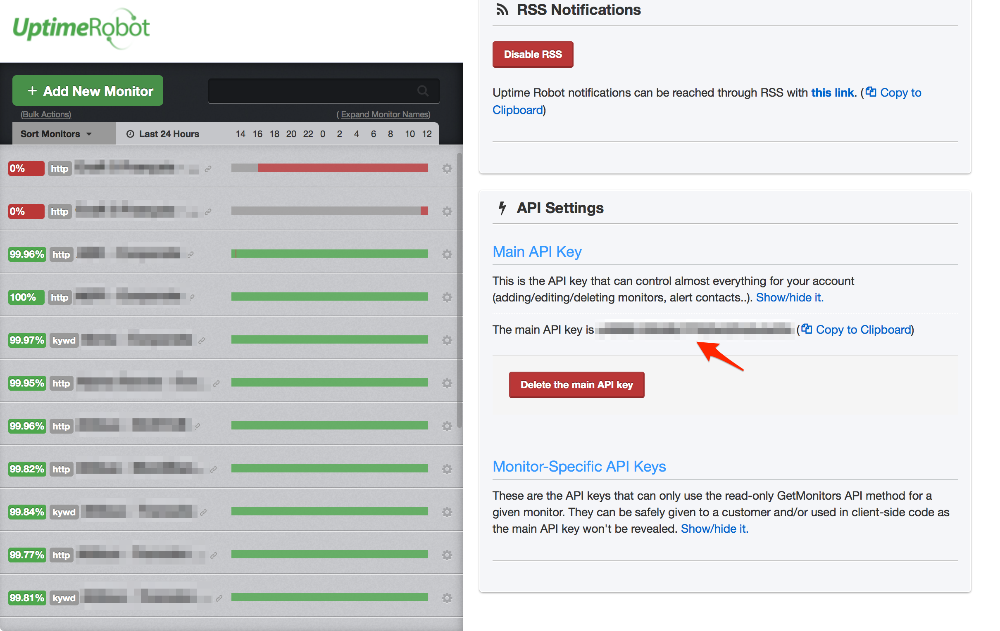
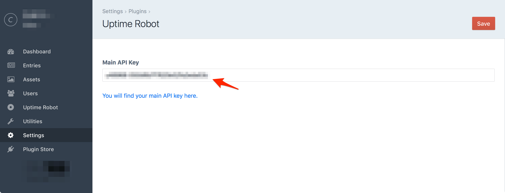
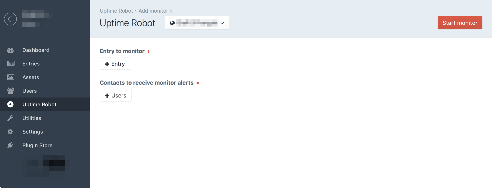
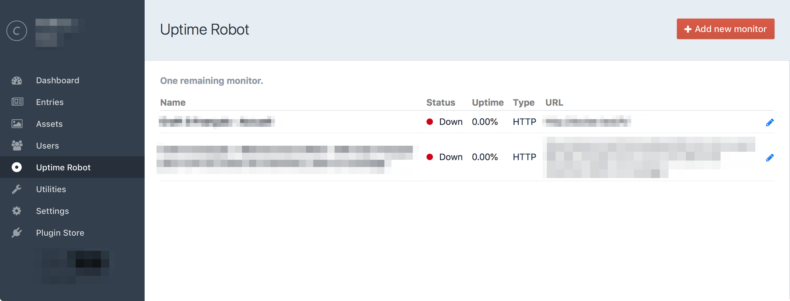
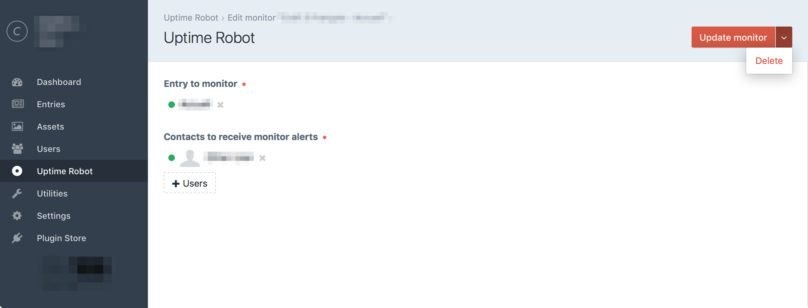
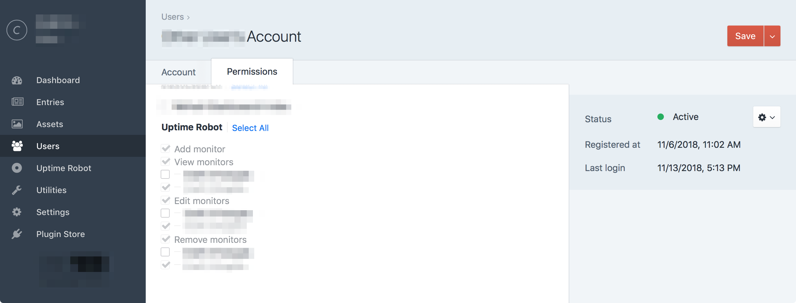

[][uptime-robot-site]

# Uptime Robot plugin for Craft CMS 3.x

Monitor your Craft CMS sites with [Uptime Robot][uptime-robot-site].

## Requirements

This plugin requires Craft CMS 3.0.0 or later.

## Installation

### The easy way

Just install the plugin from the [Craft Plugin Store][craft-plugin-store].

### Using Composer

  - Install with Composer from your project directory: `composer require la-haute-societe/craft-restrict-asset-delete`
  - In the Craft Control Panel, go to Settings → Plugins and click the **Install** button for Restrict Asset Delete plugin.

## Uptime Robot Overview

Uptime Robot is a website monitoring service which offers up to 50 free monitors.

This plugin can help you to supervise the availabilty of your Craft site by adding related Uptime Robot monitors.

You can a monitor for any entry and site you wish.

You can also select which user will receive email alerts if the site goes down.

## Configuring Uptime Robot

### Uptime Robot account
To use this plugin, you will have to open an Uptime Monitor account first.

You can do so by visiting their [signup page](https://uptimerobot.com/signUp).

### Setup the API Key

Once logged into your Uptime Robot account, you will be able to get your API key in the "My Settings" menu.

In the lower right section of the page, you can click the "Show/hide it" link to reveal the API key, generate and copy it.

Copy the API key within the Uptime Robot settings and validate to check that the plugin is able to talk to the Uptime Robot services.

> **Note:**
> Once you will start adding monitors, it's not recommended to update the API key with a different account, otherwise your existing monitors informations will become unavailable from the Craft admin panel.

## Using Uptime Robot

### Add a monitor

You can add a monitor from the main administration panel by clicking the "Add new monitor" button in the upper right corner of the screen.

> **Note:**
> If your Uptime Robot account runs out of available monitors, the button won't show up.

On the following screen, select an entry you wish to monitor. 

Optionaly, select the user(s) which will receive the monitoring alerts.

Click the "Star monitor" button in the upper right corner of the screen to save the monitor and start the monitoring.

You're done!

> **Notes:**
> 
> * When adding a user for the first time, a corresponding account will be created on the Uptime Robot service. The user will then receive an email to activate his account in order to receive the notifications.
> * If your Craft environement support multiple sites, you can select the desired one in the according drop down. 
> * There will be a slight delay between the monitor creation and its effective start during which it will appear as "Not checked yet". That is a normal behavior.

### View monitors

Every monitored entry will show up in the main Uptime Robot administration panel.
From there, you will get the monitors status and uptime informations.

To edit a monitor configuration, click the according pen icon.

> **Notes:**
> 
> * From that screen, you will see how many remaining monitors are available from your Uptime Robot account.
> * The monitors informations are refreshed every 5 minutes.

### Edit a monitor

The edition screen allows you to change the entry and the alert contacts users.

You can also remove the monitor by using the "Delete" action from the upper right menu button.

> **Warning:**
> Be aware that if you remove a monitor, you will lose every monitoring logs from the Uptime Robot service accordingly.

### Uptime Robot users permissions

From the users permissions panel, you will be able to set the following permissions:

* Add monitors
* View monitors
* Edit monitors
* Remove monitors

If the Craft environement support multiple sites, you will be able to set the permissions per site.

> **Note:**
> User will only be able to add monitors for the sites he owns the permission. 

### Uptime Robot Widget

You can use the Uptime Robot widget to list monitors with there status and uptime informations. Simply add the widget from the dashboard screen by clicking the "New widget" button and select the "Uptime Robot" widget.

## Uptime Robot Roadmap

* Be able to set various parameters like interval and HTTP Authentication per monitor
* Handle Keyword monitor type with dedicated Twig macro to inject the keyword in the entry page
* Be able to pause/restart a monitor
* Detail view with reponse time
* More useful widget

Brought to you by [ La Haute Société][lhs-site].

[uptime-robot-site]: https://uptimerobot.com
[lhs-site]: https://www.lahautesociete.com
[craft-plugin-store]: https://plugins.craftcms.com
